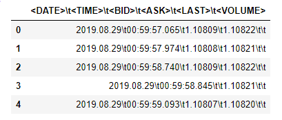
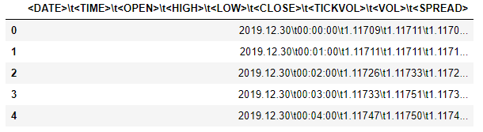
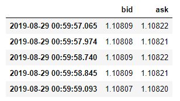
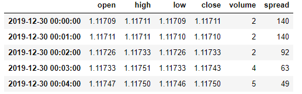

# Metatrader5 historical data to Pandas DataFrame converter

## What is this?

This is a simple module with functions that will allow you to convert historical tick or OHLC data exported from Metatrader5 into a Pandas DataFrame.

## Why is it needed?

Historical price data exported from Metatrader5 in a csv format is difficult to work with and looks like this:

*mt5_tick_output*         | *mt5_ohlc_output*
:----------------------:|:-----------------------:
 | 

<br>

In order to be able to work with the data we need to convert it into this:

*tick_converted*          | *ohlc_converted*
:----------------------:|:-----------------------:
 | 


## Usage

```python
from mt5_data_converter import *

tick_path = 'User/data/tick_data.csv'
ohlc_path = 'User/data/ohlc_data.csv'

convert_tick(tick_path)
convert_ohlc(ohlc_path)
```
